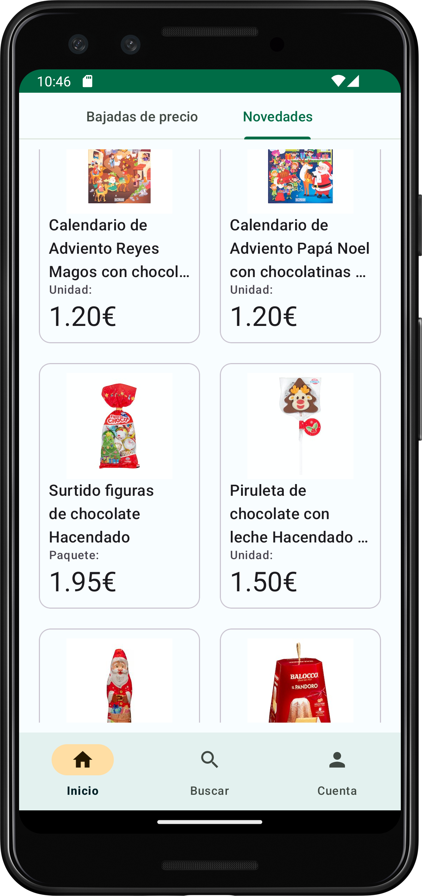
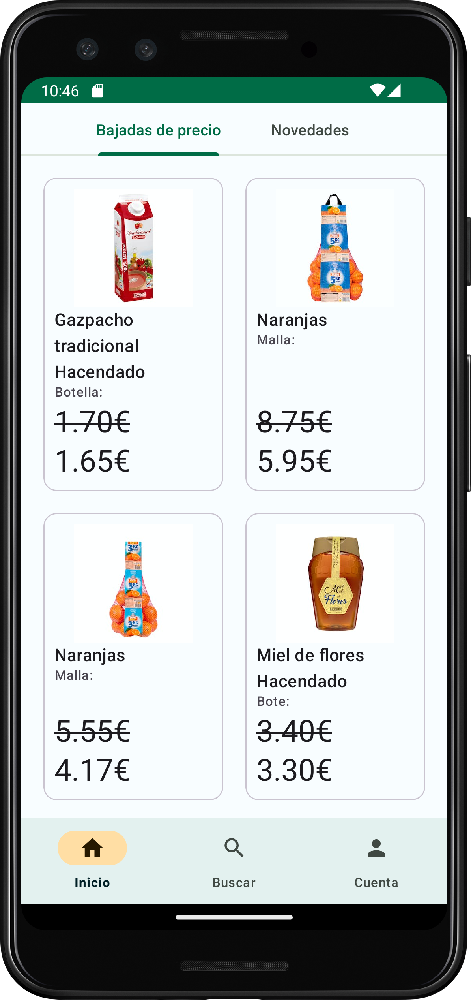
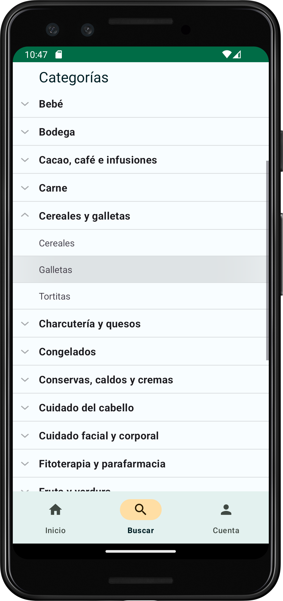
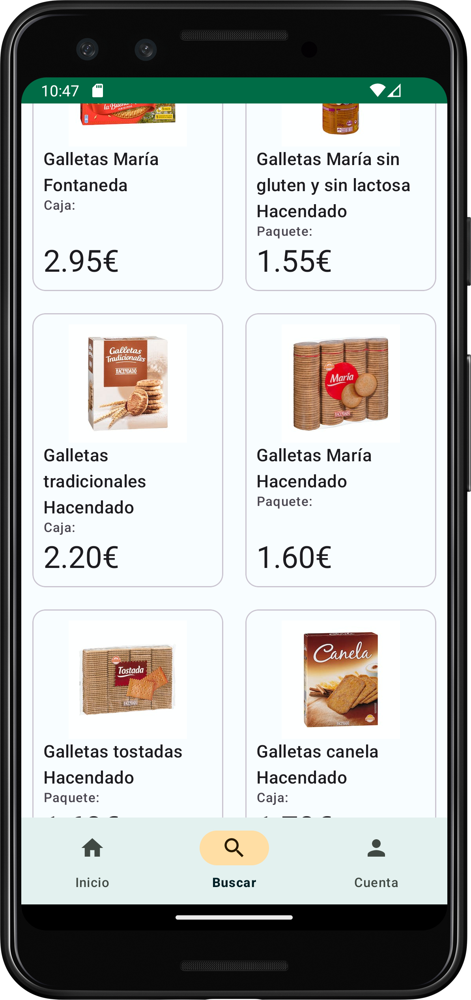
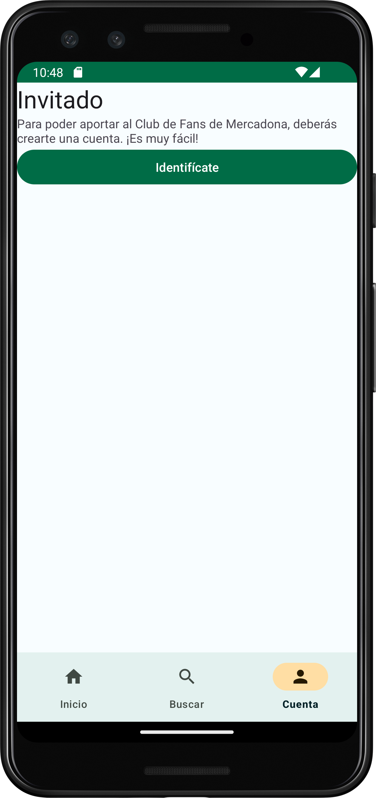
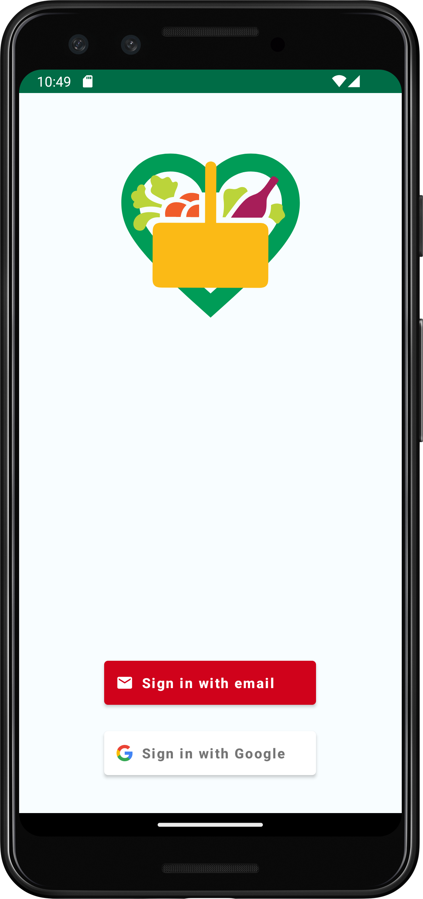
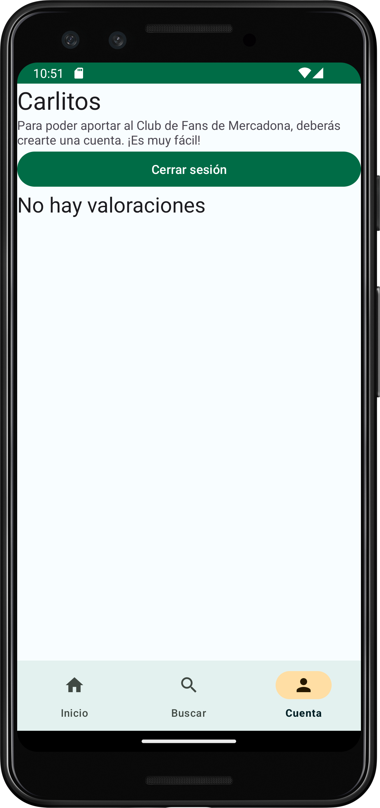
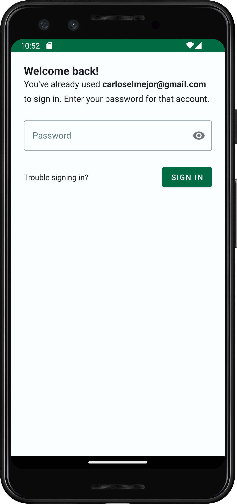
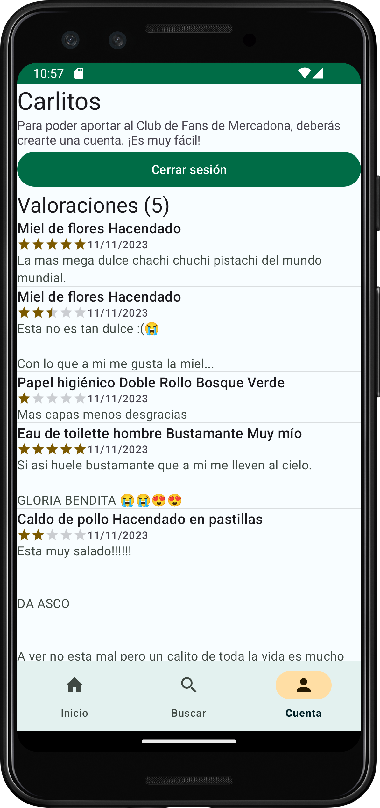

# Mercadona Fan Club Android app

## Descripción

Mercadona Fan Club es una aplicación que permite a los usuarios de Mercadona compartir sus experiencias de compra con el resto de usuarios. Los usuarios podrán compartir sus opiniones sobre los productos que han comprado. Además, podrán consultar las opiniones de otros usuarios sobre los productos.

Video: 

 

## Funcionalidad

### Pantalla principal

En la pantalla principial, los usuarios verán, de un vistazo, los usuarios más atractivos para valorar, es decir, los productos nuevos que ha sacado Mercadona
y los productos que han bajado de precio recientemente.

Al cliclear en cualquiera de ellos, navegará a la pantalla de detalle del producto.

### Buscar

Mediante la pantalla de búsqueda, los usuarios podrán buscar productos por categoría. Inicialmente, se muestra la lista de categorías y sus subcategorías.
Al clickear en una subcategoría, se mostrarán los productos de esa subcategoría. Al cliclear en cualquiera de ellos, navegará a la pantalla de detalle del producto.

### Cuenta

En la pantalla de cuenta, los usuarios podrán iniciar sesión o crear una cuenta. Al estar logueado, el usuario podrá ver sus valoraciones.
Al clickear en cualquiera de ellas, navegará a la pantalla de detalle del producto.

### Detalle del producto

TODO CAPTURAS

En la pantalla de detalle del producto, los usuarios podrán ver las valoraciones de otros usuarios sobre el producto. Además, podrán aportar su valoración.

En la parte superior, se muestra un carrusel con las imágenes del producto. Pinchando en cualquiera de ellas, se abrirá la imagen en pantalla completa.

Al clickear en la barra de estrellas, se abrirá un modal donde el usuario podrá valorar el producto.

Pulsando el botón de verificación, se abrirá la cámara y se podrá escanear el código de barras del producto.
Si el código de barras coincide con el del producto, se marcará como verificada la valoración.

En la parte inferior, se muestra un listado con las valoraciones de otros usuarios. Por motivos de población de la base de datos, no he limitado el número de valoraciones,
por lo que un usuario puede valorar un producto varias veces. En un futuro, se limitaría el número de valoraciones por usuario y producto a 1.

## Usuarios - Firebase Authentication

La aplicación cuenta con un sistema de usuarios. Si no dispones de cuenta, puedes autenticarte vía Google o email.  
 in cuenta, el usuario podrá ver los productos y las valoraciones de ellos, pero no podrá aportar.

Para crear una cuenta, el usuario debe acudir a cuenta, y crearse una cuenta / iniciar sesión.  
Una vez iniciada sesión, el usuario podrá aportar sus valoraciones sobre los productos. Además, en el apartado de cuenta, podrá ver sus valoraciones.  
Al clickear en cualquiera de ellas, navegará a la pantalla de detalle del producto, donde podrá ver el resto de valoraciones.

## Productos y categorías - Mercadona API

La aplicación cuenta con un sistema de productos. Los productos se obtienen de la API de Mercadona. Gracias a este API, podemos obtener productos de mercadona:

- https://tienda.mercadona.es/api/home/new-arrivals/ : Obtiene los productos nuevos de Mercadona.
- https://tienda.mercadona.es/api/home/price-drops/ : Obtiene los productos que han bajado de precio.
- https://tienda.mercadona.es/api/categories/ : Obtiene las categorías de productos de Mercadona.
- https://tienda.mercadona.es/api/categories/{{category_id}} : Obtiene los productos de una categoría.
- https://tienda.mercadona.es/api/products/{{product_id}} : Obtiene el detalle de un producto.

Este API no esta documentada por ningún lado, por lo que ha sido complicado utilizarla.
Además, no cuenta con endpoint de búsqueda de productos por nombre / código de barras, por lo que implementar un buscador era complicado por el momento.

## Valoraciones - Firebase Firestor

Las valoraciones de los usuarios se almacenan en una base de datos.La base de datos utilizada es Firebase Firestore.
En ella, se almacenan las valoraciones de los usuarios. Cada valoración cuenta con un id de usuario, un id de producto, un comentario y una puntuación.
Además, se almacena la fecha de creación de la valoración. Por último, se almacena un campo booleano que indica si el usuario ha verificado su compra.
Esto se hace de forma sencilla escanenando el código de barras del producto. Si el código de barras coincide con el del producto, se marca como verificada la valoración.

Una valoración en base de datos sigue el siguiente esquema:

- author: (string)
- date : (timestamp)
- id (string)
- productName : (string)
- rating : (number)
- review : (string)
- userId : (string)
- verified : (boolean)

### Código de barras - ML Kit

Para leer los códigos de barras se ha utilizado el API de Vision de ML Kit de Google.
Se ha escogido la implementación que ofrece Google para desarrollar esta funcionalidad mucho más rápido, ya que no necesitaba funcionalidades especiales.
Para ello, se delega la tarea de escanear el código a los Servicios de Google Play.
Todo el procesamiento de imágenes se lleva a cabo en el dispositivo, por lo que la app no requiere permisos de cámara.
Google no almacena los resultados ni los datos de imagen. Requiere de los servicios de Google Play instalados en el dispositivo.

TODO CAPTURAS
